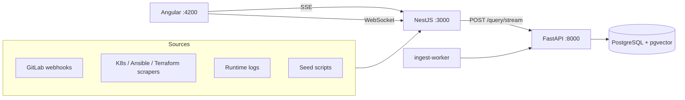

# DevSecOps RAG Analyzer

AI-powered incident analysis for DevSecOps teams. Correlates Kubernetes manifests, Ansible playbooks, Terraform, GitLab CI output, and runtime logs to explain errors like **X-402 payment gateway timeouts**.

**Stack:** Angular UI · NestJS API · FastAPI RAG engine · PostgreSQL + pgvector

## Architecture



| Layer | Role |
|-------|------|
| **frontend** | Streaming chat, context panel, filters, incident feed |
| **backend** | API gateway, webhooks, scrape orchestration, job tracking |
| **rag-engine** | Hybrid retrieval (dense + FTS + RRF), LLM streaming |
| **ingest-worker** | Polls job queue, chunks documents, calls `/ingest` |

## Prerequisites

| Tool | Notes |
|------|-------|
| Node.js 20+ | Backend and frontend |
| Python 3.11–3.12 | RAG engine (venv via setup script) |
| Docker Desktop | PostgreSQL and full stack |

## Quick start

```powershell
cd devsecops-rag-analyzer
.\scripts\setup.ps1
```

Linux/macOS: `./scripts/setup.sh`

1. Copy and edit `.env` from `.env.example`.
2. Start the stack:
   ```powershell
   docker compose --profile ollama up -d
   ```
3. Pull Ollama models (if using local LLM):
   ```powershell
   docker exec devops-rag-ollama ollama pull llama3.2
   docker exec devops-rag-ollama ollama pull nomic-embed-text
   ```
4. Seed demo data:
   ```powershell
   .\scripts\seed.ps1
   ```
5. Open **http://localhost:4200**

### Demo query

Use **Environment: staging** (all seed data is staging-tagged). Example:

> X-402 payment service staging deploy failure

Expected root cause in seed data: `gateway_timeout_seconds` reduced from **30s → 5s** (MR !287).

## LLM configuration

| Provider | `.env` | Notes |
|----------|--------|-------|
| **OpenAI** (fastest) | `LLM_PROVIDER=openai`, `OPENAI_API_KEY`, `EMBEDDING_DIMENSION=1536` | Default in `.env.example` |
| **Ollama** (private) | `LLM_PROVIDER=ollama`, `EMBEDDING_DIMENSION=768` | Requires `nomic-embed-text`; DB column must match dimension |
| **Anthropic** | `LLM_PROVIDER=anthropic`, `ANTHROPIC_API_KEY` | Optional |

Hybrid retrieval works without an LLM key; generation returns a placeholder until configured.

## API overview

| Endpoint | Service | Purpose |
|----------|---------|---------|
| `POST /api/chat` | NestJS | Query → RAG |
| `POST /api/chat/stream` | NestJS | SSE streaming answers |
| `GET /api/health` | NestJS | API + RAG health |
| `POST /api/webhooks/gitlab` | NestJS | CI/CD webhooks |
| `POST /api/ingest/logs` | NestJS | Runtime log forwarding |
| `POST /api/ingest/scrape/k8s` | NestJS | K8s manifest scrape |
| `GET /api/ingest/jobs` | NestJS | Ingestion job status |
| `POST /query` | RAG | Hybrid retrieval + LLM |
| `POST /ingest` | RAG | Index chunks |

WebSocket incident feed: `ws://localhost:3000/events`  
REST examples: `api/dev.http` (VS Code REST Client)

Swagger: **http://localhost:3000/api/docs**

## Project structure

```
devsecops-rag-analyzer/
├── frontend/           # Angular dashboard
├── backend/            # NestJS API gateway
├── rag-engine/         # FastAPI + hybrid RAG
├── scripts/            # setup, seed, init-db.sql
├── deploy/aws/         # EKS manifests
├── deploy/terraform/   # AWS IaC skeleton
└── docker-compose.yml
```

## Local development

**Docker (recommended):** one command runs postgres, rag-engine, backend, frontend, ingest-worker, ollama.

**Manual dev:** start postgres → rag-engine → backend → frontend. Do not run Docker and local services on the same port.

| Port | Service |
|------|---------|
| 4200 | Frontend |
| 3000 | Backend |
| 8000 | RAG engine |
| 5432 | PostgreSQL |

If port 3000 is in use (`EADDRINUSE`), stop the Docker backend or run local backend on another port:

```powershell
$env:BACKEND_PORT=3001; npm run start:dev   # in backend/
```

## AWS deployment

- [deploy/aws/README.md](deploy/aws/README.md) — EKS manifests, S3 archival, GitLab webhook URL
- [deploy/terraform/README.md](deploy/terraform/README.md) — Terraform skeleton for S3 + EKS

## Troubleshooting

| Issue | Fix |
|-------|-----|
| RAG unreachable | Check `http://localhost:3000/api/health`; ensure rag-engine is up on `RAG_ENGINE_URL` |
| Port 8000 taken | Set `RAG_ENGINE_PORT=8001` and `RAG_ENGINE_URL=http://localhost:8001` |
| Ingest 500 with Ollama | Set `EMBEDDING_DIMENSION=768`; DB column must be `vector(768)` |
| 0 context chunks | Use **staging** environment filter; production seed data does not exist |
| Docker backend vs local | Stop `devops-rag-backend` before `npm run start:dev` |

Use `postgresql+psycopg://` in `DATABASE_URL` for local Python runs.

## What's left (optional)

Core MVP is complete. Remaining items are polish and production hardening:

| Priority | Item |
|----------|------|
| Low | UI warning when environment filter returns zero chunks |
| Low | Expand e2e coverage beyond smoke test |
| Low | Bedrock / managed embedding provider for AWS |
| Ops | RDS instead of in-cluster Postgres for production |
| Ops | GPU nodes or Bedrock for Ollama replacement on EKS |
| Ops | Secrets manager instead of K8s secret files |

## Service docs

- [backend/README.md](backend/README.md)
- [frontend/README.md](frontend/README.md)
- [rag-engine/README.md](rag-engine/README.md)
