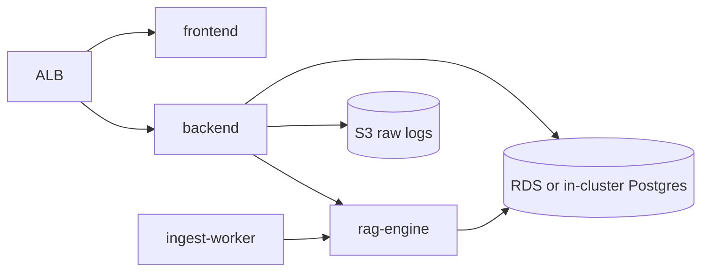

# AWS deployment (EKS)

Deploy the DevSecOps RAG Analyzer to Amazon EKS with optional S3 log archival.

## Prerequisites

- AWS CLI with IAM permissions
- `kubectl` and `eksctl` (or use [Terraform](../terraform/README.md))
- Container images in ECR

## Architecture



## Steps

### 1. Build and push images

```bash
aws ecr get-login-password --region us-east-1 | docker login --username AWS --password-stdin <account>.dkr.ecr.us-east-1.amazonaws.com

for svc in frontend backend rag-engine; do
  docker build -t devsecops-rag-$svc ./$svc
  docker tag devsecops-rag-$svc <account>.dkr.ecr.us-east-1.amazonaws.com/devsecops-rag-$svc:latest
  docker push <account>.dkr.ecr.us-east-1.amazonaws.com/devsecops-rag-$svc:latest
done
```

### 2. S3 bucket (raw logs)

```bash
aws s3 mb s3://devsecops-rag-raw-logs --region us-east-1
```

Set `AWS_S3_BUCKET` and `AWS_REGION` in the backend secret.

### 3. EKS cluster

```bash
eksctl create cluster --name devsecops-rag --region us-east-1 \
  --node-type t3.large --nodes 2
```

### 4. Apply manifests

Update image URIs in `k8s/*.yaml`, create `secret.yaml` from `.env`, then:

```bash
kubectl apply -f k8s/namespace.yaml
kubectl apply -f k8s/configmap.yaml
kubectl apply -f k8s/postgres-init-configmap.yaml
kubectl apply -f k8s/secret.yaml
kubectl apply -f k8s/postgres.yaml    # or point DATABASE_URL at RDS
kubectl apply -f k8s/rag-engine.yaml
kubectl apply -f k8s/backend.yaml
kubectl apply -f k8s/ingest-worker.yaml
kubectl apply -f k8s/frontend.yaml
kubectl apply -f k8s/ingress.yaml
```

### 5. Production variables

| Variable | Purpose |
|----------|---------|
| `DATABASE_URL` | PostgreSQL connection string |
| `RAG_ENGINE_URL` | Internal rag-engine service URL |
| `AWS_S3_BUCKET` | Log archival |
| `GITLAB_WEBHOOK_SECRET` | Webhook validation |
| `API_KEY` | Protect chat/ingest |
| `LLM_PROVIDER` | `openai`, `anthropic`, or `ollama` |

GitLab webhook URL: `https://<alb-domain>/api/webhooks/gitlab`

For private LLM on EKS, deploy Ollama with GPU nodes or use Amazon Bedrock.
