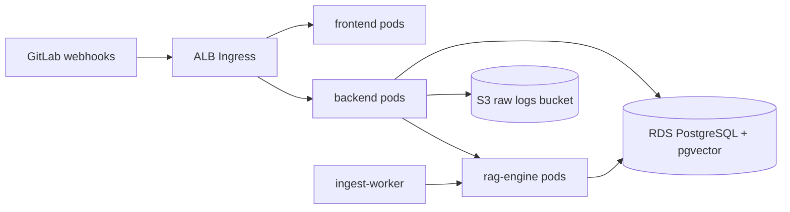

# AWS Deployment Guide

Deploy the DevSecOps RAG Analyzer to Amazon EKS with S3 for long-term log archival.

## Prerequisites

- AWS CLI configured with appropriate IAM permissions
- `kubectl` and `eksctl` (or Terraform) installed
- Container images pushed to ECR

## Architecture



## 1. Build and push images

```bash
aws ecr get-login-password --region us-east-1 | docker login --username AWS --password-stdin <account>.dkr.ecr.us-east-1.amazonaws.com

docker build -t devsecops-rag-frontend ./frontend
docker build -t devsecops-rag-backend ./backend
docker build -t devsecops-rag-engine ./rag-engine

docker tag devsecops-rag-frontend <account>.dkr.ecr.us-east-1.amazonaws.com/devsecops-rag-frontend:latest
docker tag devsecops-rag-backend <account>.dkr.ecr.us-east-1.amazonaws.com/devsecops-rag-backend:latest
docker tag devsecops-rag-engine <account>.dkr.ecr.us-east-1.amazonaws.com/devsecops-rag-engine:latest

docker push <account>.dkr.ecr.us-east-1.amazonaws.com/devsecops-rag-frontend:latest
docker push <account>.dkr.ecr.us-east-1.amazonaws.com/devsecops-rag-backend:latest
docker push <account>.dkr.ecr.us-east-1.amazonaws.com/devsecops-rag-engine:latest
```

## 2. Create S3 bucket for raw logs

```bash
aws s3 mb s3://devsecops-rag-raw-logs --region us-east-1
aws s3api put-bucket-versioning \
  --bucket devsecops-rag-raw-logs \
  --versioning-configuration Status=Enabled
```

Configure lifecycle rules for archival (e.g. transition to Glacier after 90 days).

## 3. Create EKS cluster

```bash
eksctl create cluster \
  --name devsecops-rag \
  --region us-east-1 \
  --nodegroup-name standard \
  --node-type t3.large \
  --nodes 2 \
  --nodes-min 1 \
  --nodes-max 4
```

## 4. Deploy manifests

Update image URIs in `deploy/aws/k8s/*.yaml`, then:

```bash
kubectl apply -f deploy/aws/k8s/namespace.yaml
kubectl apply -f deploy/aws/k8s/configmap.yaml
kubectl apply -f deploy/aws/k8s/secret.yaml   # create from .env first
kubectl apply -f deploy/aws/k8s/postgres.yaml   # or use RDS instead
kubectl apply -f deploy/aws/k8s/rag-engine.yaml
kubectl apply -f deploy/aws/k8s/backend.yaml
kubectl apply -f deploy/aws/k8s/ingest-worker.yaml
kubectl apply -f deploy/aws/k8s/frontend.yaml
kubectl apply -f deploy/aws/k8s/ingress.yaml
```

## 5. Environment variables (production)

| Variable | Purpose |
|----------|---------|
| `DATABASE_URL` | RDS PostgreSQL connection string |
| `AWS_REGION` | e.g. `us-east-1` |
| `AWS_S3_BUCKET` | Raw log archival bucket |
| `RAG_ENGINE_URL` | Internal service URL |
| `GITLAB_WEBHOOK_SECRET` | Webhook token validation |
| `API_KEY` | Protect chat/ingest endpoints |
| `LLM_PROVIDER` | `openai` or `ollama` |

## 6. GitLab webhook URL

Point GitLab webhooks to:

```
https://<your-alb-domain>/api/webhooks/gitlab
```

## 7. Ollama on EKS (optional)

For private LLM, deploy an Ollama StatefulSet with GPU nodes or use Amazon Bedrock as an alternative. Local Docker uses:

```bash
docker compose --profile ollama up -d
docker exec devops-rag-ollama ollama pull llama3.2
```

Set `LLM_PROVIDER=ollama` and `OLLAMA_BASE_URL=http://ollama:11434` in compose.

## Local production-like stack

```bash
docker compose up -d
docker compose --profile ollama up -d   # optional private LLM
docker compose --profile scraper up -d  # optional periodic scrape
```
