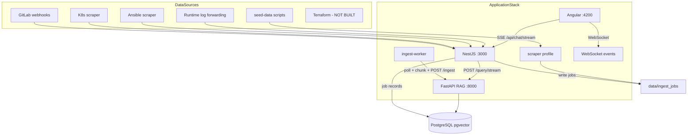
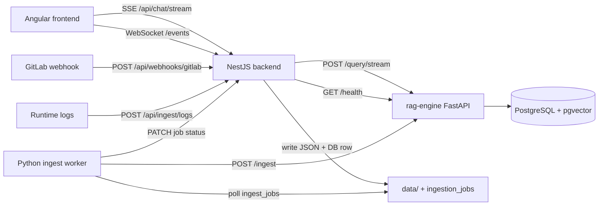

# DevSecOps RAG Analyzer — Full Project Assessment

## 1. Project Objective

The project is an **AI-powered hybrid-search RAG system for DevSecOps incident analysis**. Its goal is to help engineers quickly identify root causes of production incidents by correlating:

- Infrastructure configuration (Ansible, Terraform, Kubernetes manifests)
- CI/CD pipeline logs (GitLab)
- Runtime server logs and error traces

**Core differentiator:** Hybrid retrieval combining **dense vector search** (semantic understanding) with **sparse keyword search** (exact matches for error codes, IPs, IDs) merged via **Reciprocal Rank Fusion (RRF)**.

**Example query the system is designed to answer:**

> "We got error code X-402 on the production server. Based on our deployment scripts and past logs, what configuration change likely caused this?"

**Related documentation:**

- [PROJECT_DESCRIPTION.md](./PROJECT_DESCRIPTION.md) — full vision and architecture rationale
- [IMPLEMENTATION_PLAN.md](./IMPLEMENTATION_PLAN.md) — phase-by-phase checklist

---

## 2. Architecture (As Built)

| Component | Technology | Status |
|-----------|------------|--------|
| Frontend | Angular 21 | Streaming chat, context panel, filters, incident feed |
| API Gateway | NestJS 11 | Chat proxy, webhooks, scrape, logs, job API, WebSockets |
| RAG Engine | FastAPI + LangChain | Hybrid retrieval + streaming LLM |
| Database | PostgreSQL + pgvector | Chunks + `ingestion_jobs` tracking |
| Ingestion | File queue + DB + Python worker | Automated in Docker |
| Docker | docker-compose (6 services) | postgres, rag-engine, backend, frontend, ingest-worker, ollama |
| Cloud (AWS) | EKS + S3 | Deployment manifests in `deploy/aws/` |

### Current data flow

---

## 3. What Has Been Done (By Phase)

### Phase 1 — Data Ingestion & Processing (~85% complete)

**Done:**

- GitLab webhook receiver at `POST /api/webhooks/gitlab`
- K8s manifest scraper (backend filesystem + RAG-engine kubectl API)
- Ansible playbook fetcher (backend filesystem + RAG-engine git clone)
- Runtime log forwarding at `POST /api/ingest/logs`
- Chunking heuristics (tracebacks, YAML blocks, paragraph splits)
- Ingest worker with processed/failed queues
- Direct ingest API `POST /ingest` on RAG engine
- DB schema with metadata columns + FTS
- Demo seed pipeline (`scripts/seed.ps1`, `scripts/seed-data/`)
- Docker automation: `ingest-worker` + optional `scraper` profile
- DB-backed `ingestion_jobs` table with job status API

**Not done:**

- Terraform ingestion (mentioned in vision, no scraper)
- Backend scrape DTO `api`/`git` modes (RAG-engine CLI supports them; NestJS filesystem only)
- GitLab webhook event-type parsing (raw JSON enqueue only)
- Reindex/dedup on re-ingest

---

### Phase 2 — Hybrid RAG Engine (~90% complete)

**Done:**

- Dense vector search via pgvector cosine distance
- Sparse search via PostgreSQL FTS (`ts_rank` + `plainto_tsquery`)
- RRF merge
- Embeddings: OpenAI + Ollama with graceful fallback
- LLM generation: OpenAI + Ollama, sync + SSE streaming
- Metadata pre-filtering: `environment` and `source_types` in SQL
- IVFFlat + GIN indexes

**Gaps:**

- True BM25 indexing (Postgres FTS used; `rank-bm25` unused)
- Anthropic provider documented but not implemented
- No rag-engine unit/integration tests
- No chunk update/delete/reindex APIs

---

### Phase 3 — Backend Orchestration (~80% complete)

**Done:**

- `POST /api/chat` and `POST /api/chat/stream` (SSE proxy)
- `GET /api/health`
- `POST /api/ingest/scrape/k8s|ansible`
- `POST /api/ingest/logs` (runtime log forwarding)
- `GET /api/ingest/jobs` and `GET /api/ingest/jobs/:id`
- `POST /api/webhooks/gitlab`
- Global `ValidationPipe`, `AllExceptionsFilter`, CORS
- Optional API key auth (`ApiKeyGuard`)
- WebSocket events gateway for real-time incident feed
- Unit tests for chat, scrape, webhooks, API key guard, RAG error util

**Not done:**

- `POST /api/ingest` proxy to RAG
- Rate limiting, JWT/session auth, OpenAPI/Swagger
- Scaffold leftover: `GET /` returns "Hello World!"

---

### Phase 4 — Frontend Dashboard (~80% complete)

**Done:**

- Angular 21 standalone dashboard
- SSE streaming answers with loading/streaming states
- Context visualizer with line highlighting
- Environment and source-type filter controls
- Multi-turn chat history
- Real-time incident feed via WebSocket
- Dev proxy + production nginx (SSE + WebSocket friendly)
- `environment.prod.ts` for production builds

**Not done:**

- Rich answer rendering (markdown, code blocks)
- Explicit cancel-stream button
- Dashboard/ChatService unit tests; no e2e tests

---

### Phase 5 — Containerization & Deployment (~85% complete)

**Done:**

- `docker-compose.yml`: postgres, rag-engine, backend, frontend, ingest-worker, ollama
- Optional `scraper` profile
- Dockerfiles for all app services
- Shared `./data` volume
- Postgres healthcheck + init SQL mount
- Windows setup: `scripts/setup.ps1`
- Linux/macOS setup: `scripts/setup.sh`
- AWS deployment guide + K8s manifests in `deploy/aws/`

**Not done:**

- Full Terraform/IaC for AWS (manifests provided; operator applies manually)
- Backend/rag-engine healthchecks in compose

---

## 4. What Works End-to-End Today

1. `scripts/setup.ps1` or `scripts/setup.sh` → configure `.env`
2. `docker compose up -d` (includes ingest-worker + ollama)
3. `scripts/seed.ps1` or scrape/log/webhook triggers populate `document_chunks`
4. Query at `http://localhost:4200` → streamed answer + highlighted context + live incident feed

| Flow | Status |
|------|--------|
| GitLab webhook → indexed chunks | Works when ingest-worker is running |
| Runtime log POST → indexed chunks | Works via `POST /api/ingest/logs` |
| Environment-filtered queries | Works (UI filters + RAG SQL filters) |
| Real-time incident feed | WebSocket events on ingest/webhook activity |
| AWS production deploy | K8s manifests + S3 guide in `deploy/aws/` |

---

## 5. Phase Completion Summary

| Phase | Goal | Completion | Verdict |
|-------|------|------------|---------|
| **1** | Ingestion & chunking | ~85% | Webhooks, scrapers, logs, worker, DB jobs done; Terraform missing |
| **2** | Hybrid RAG | ~90% | Core engine production-viable |
| **3** | API gateway | ~80% | Streaming, validation, auth, jobs API, WebSockets done |
| **4** | Angular dashboard | ~80% | Streaming, context panel, filters, multi-turn, live feed done |
| **5** | Docker & AWS | ~85% | Local stack + Ollama + AWS manifests done |

**Overall project maturity: ~85%**

---

## 6. Remaining Work

1. Terraform scraper (if still in scope)
2. Reindex/dedup strategy for re-ingest
3. Anthropic LLM provider
4. rag-engine and frontend test coverage
5. Rich markdown answer rendering
6. Full Terraform IaC for AWS (optional)

---

*Assessment updated: June 2026*
